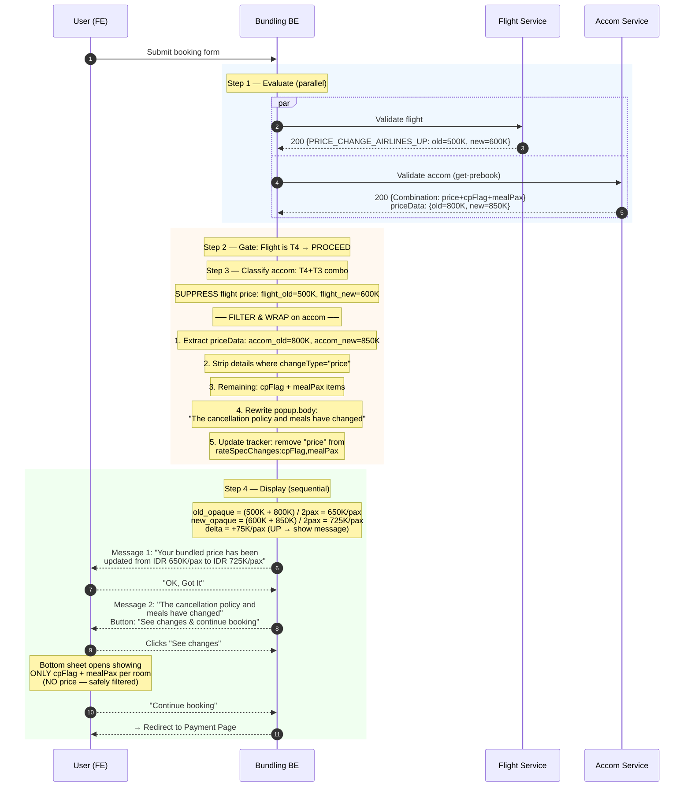
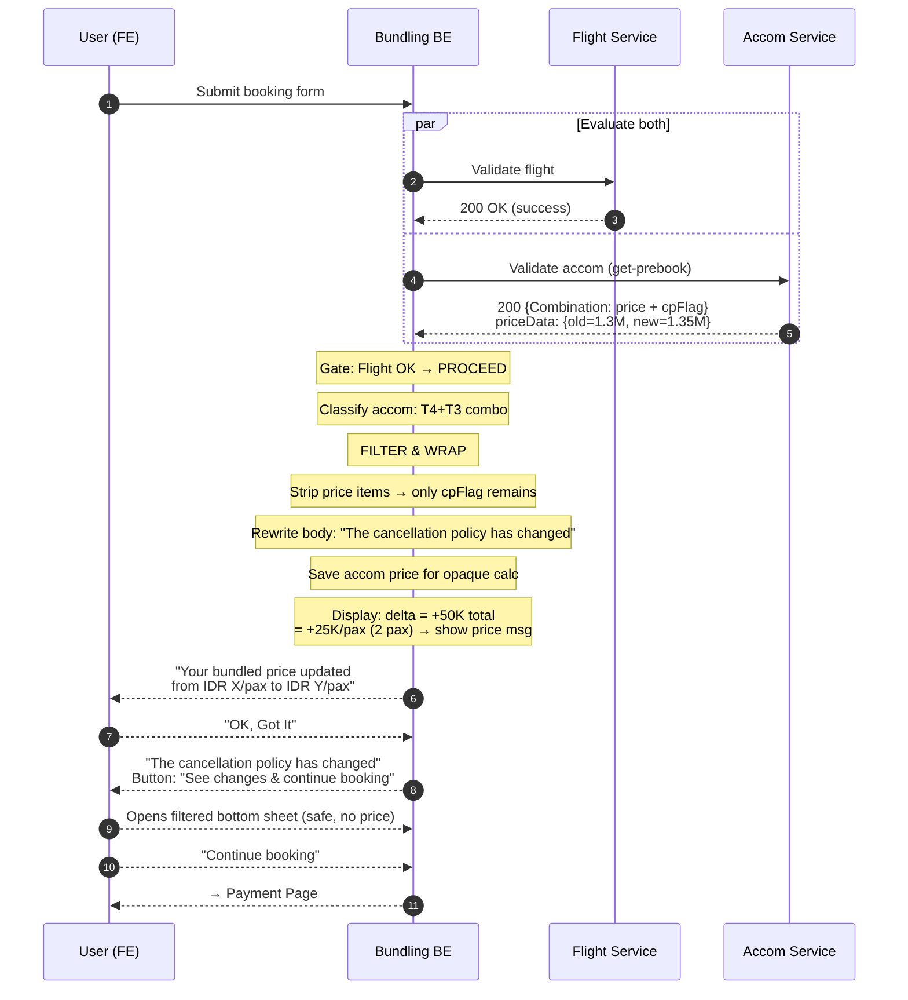
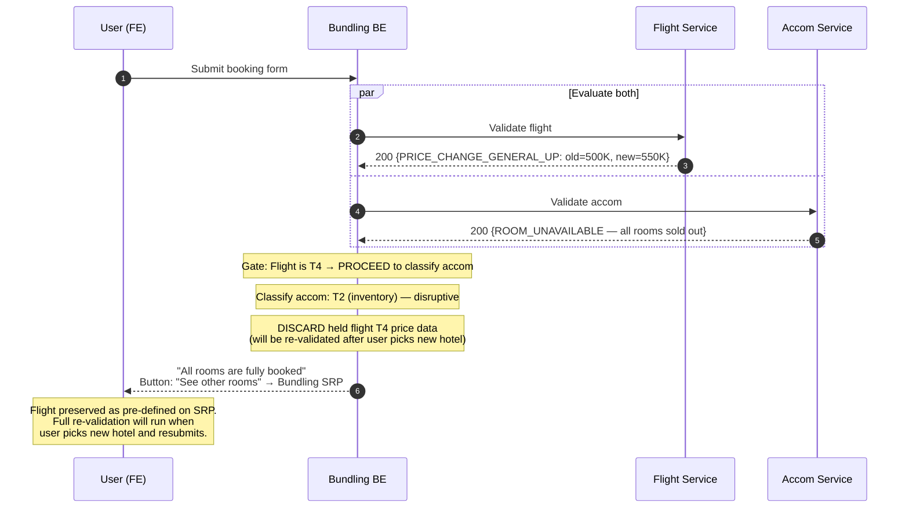
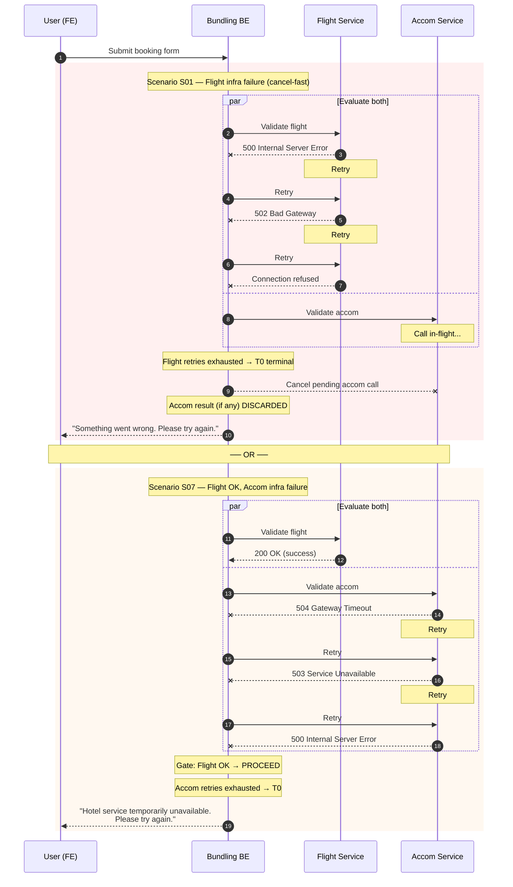
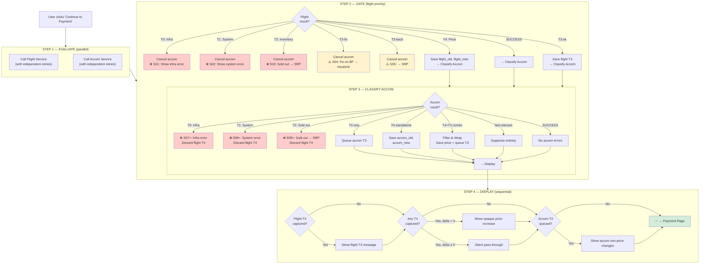

# Bundling Error Scenario Permutations — Complete Matrix

> **Status**: SPECIFICATION
> **Date**: 2026-04-16
> **Framework**: Approach E + B-lite ("Filter & Wrap") from error_aggregation_brainstorm.md
> **Architecture**: Parallel Evaluation + Sequential Display (cancel-fast on flight terminal)
> **Method**: Map-Reduce — individual error classification → cross-product permutation → handling resolution
> **Companion**: `error-handling-improved-recommendation.md` (5-tier framework reference)

---

## Table of Contents

0. [Sequence Diagrams](#0-sequence-diagrams)
   - 0.1 Master Orchestration Flow
   - 0.2 Scenario S28 — The Hardest Case
   - 0.3 Scenario S12 — Accom Combination Without Flight Issues
   - 0.4 Scenario S25 — Flight Price Discarded on Accom Sold Out
   - 0.5 Scenario S01/S07 — Non-200 Infrastructure with Retry
   - 0.6 Tier Priority & Flow Summary
1. [MAP Phase 1: Flight Error Classification](#1-map-phase-1-flight-error-classification)
2. [MAP Phase 2: Accommodation Error Classification](#2-map-phase-2-accommodation-error-classification)
3. [MAP Phase 3: Cross-Vertical State Enumeration](#3-map-phase-3-cross-vertical-state-enumeration)
4. [REDUCE Phase 1: Core Permutation Matrix (T0-T4 × T0-T4)](#4-reduce-phase-1-core-permutation-matrix)
5. [REDUCE Phase 2: Detailed Handling per Cell](#5-reduce-phase-2-detailed-handling-per-cell)
6. [REDUCE Phase 3: Edge Cases & Compound Scenarios](#6-reduce-phase-3-edge-cases--compound-scenarios)
7. [REDUCE Phase 4: Non-200 Specific Scenarios](#7-reduce-phase-4-non-200-specific-scenarios)
8. [Summary: Error Display Decision Tree](#8-summary-error-display-decision-tree)

---

## 0. Sequence Diagrams

### 0.1 Master Orchestration Flow

Parallel evaluation with cancel-fast on flight terminal errors. All 29 scenarios flow through this single orchestration.

```mermaid
sequenceDiagram
    autonumber
    participant U as User (FE)
    participant B as Bundling BE<br/>(Orchestrator)
    participant F as Flight Service
    participant A as Accom Service

    U->>B: "Continue to Payment" (submit booking form)

    Note over B: ═══ STEP 1: EVALUATE (parallel) ═══

    rect rgb(240, 248, 255)
        par Both verticals called simultaneously
            B->>F: Validate flight (prebook/book)
            Note over F: Independent retries:<br/>T0 → retry 2× (1s, 3s)<br/>T1 → retry 1× (2s)
        and
            B->>A: Validate accom (get-prebook / book)
            Note over A: Independent retries:<br/>T0 → retry 2× (1s, 3s)<br/>T1 → retry 1× (2s)
        end
    end

    Note over B: ═══ STEP 2: GATE (flight priority) ═══

    rect rgb(255, 248, 240)
        alt Flight T0/T1/T2/T3-fix/T3-back — TERMINAL
            Note over B: Flight result is terminal error
            B--xA: Cancel pending accom call (if still in-flight)
            Note over B: Accom result (if any) DISCARDED

            alt T0 — Infra failure
                B-->>U: [S01] "Something went wrong. Please try again."
            else T1 — System error
                B-->>U: [S02] Flight system error (remapped → BF)
            else T2 — Inventory (sold out)
                B-->>U: [S03] "Tickets sold out" (remapped → SRP)
            else T3-fix — Validation error
                B-->>U: [S04] "Passenger name too short" (→ fix on BF)
                U->>B: User fixes & resubmits
                Note over B: Re-run from Step 1 (both calls)
            else T3-back — User chose "Search other flights"
                B-->>U: [S05] Flight error → redirect to SRP
            end

        else Flight T3-ok/T4/SUCCESS — PROCEED
            Note over B: Flight passed gate. Await accom result.
            Note over B: Classify flight result: save T3-ok or T4 data.
        end
    end

    Note over B: ═══ STEP 3: CLASSIFY ACCOM ═══
    Note over B: (only reached if flight passed gate)

    rect rgb(255, 252, 240)
        alt Accom T0/T1 — Infra or system failure
            Note over B: Discard any held flight T4
            B-->>U: [S07+] Accom infra/system error (→ BF)
        
        else Accom T2 — All rooms sold out
            Note over B: Discard any held flight T4
            B-->>U: [S09+] "All rooms fully booked" (→ SRP)

        else Accom T3 only — Non-price changes
            Note over B: Queue accom T3 for display

        else Accom T4 standalone — Price change only
            Note over B: SUPPRESS. Save accom_old, accom_new.

        else Accom T4+T3 combo — Price + non-price mixed
            Note over B: ── FILTER & WRAP ──
            Note over B: 1. Extract priceData → save accom_old/new
            Note over B: 2. Strip changeType="price" items
            Note over B: 3. Strip non-relevant (maxOcc, etc.)
            Note over B: 4. Rewrite popup.body & tracker
            Note over B: 5. Queue remaining T3 items

        else Accom NR / SUCCESS
            Note over B: Suppress NR entirely. Proceed.
        end
    end

    Note over B: ═══ STEP 4: DISPLAY (sequential) ═══

    rect rgb(240, 255, 240)
        opt Flight T3-ok was captured
            B-->>U: Flight T3 non-price message
            U-->>B: "OK, Got It"
        end

        alt Any T4 captured AND net delta > 0
            B-->>U: "Your bundled price updated from IDR X/pax to IDR Y/pax"
            U-->>B: "OK, Got It"
        else Any T4 captured AND net delta ≤ 0
            Note over B: Silent pass-through (price decreased)
        end

        opt Accom T3 queued
            B-->>U: Accom non-price changes (filtered if from combo)
            U-->>B: "Continue booking" / "See changes"
        end

        B-->>U: → Redirect to Bundling Payment Page
    end
```



### 0.2 Scenario S28 — The Hardest Case (Flight Price + Accom Combination)

Flight has a price change AND Accom returns a combination error with price + non-price changes mixed together. This is the most complex orchestration path.



### 0.3 Scenario S12 — Accom Combination Without Flight Issues

Flight passes cleanly. Accom returns the combination error. Shows the Filter & Wrap in isolation.



### 0.4 Scenario S25 — Flight Price Discarded on Accom Sold Out

Flight has a price change, but Accom inventory is gone. Both results arrive from parallel evaluation; gate logic discards flight T4 because accom T2 makes the booking unviable.



### 0.5 Scenario S01/S07 — Non-200 Infrastructure with Retry

Shows the silent retry pattern for infrastructure failures in the parallel model. In S01, flight fails and accom call is cancelled. In S07, both calls fire but accom fails after retries.



### 0.6 Tier Priority & Flow Summary

Shows the 4-step parallel model: EVALUATE → GATE → CLASSIFY → DISPLAY.



---

## 1. MAP Phase 1: Flight Error Classification

Source: `references/flight-error-message-error-spec.tsv` (filtered: "Shown to Users in 1st phase = Yes")

### 1.1 Flight T0: Infrastructure Errors (Non-200)

These are NOT in the TSV — they represent failures BEFORE the application can return a structured error response.

| Error Condition | HTTP Status | Detection Method | Bundling Action |
|---|---|---|---|
| Flight service unreachable | Connection refused | TCP connection failure | Retry 2× → show infra error |
| Flight service timeout | No response within SLA | Request timeout (10s default) | Retry 2× → show infra error |
| Flight service 500 | 500 Internal Server Error | HTTP status code | Retry 2× → show infra error |
| Flight service 502/503/504 | 502/503/504 | HTTP status code | Retry 2× → show infra error |
| Malformed response | 200 but unparseable body | JSON parse failure | Treat as T0, retry 1× → show infra error |
| Circuit breaker open | N/A (short-circuited) | Resilience4j/Hystrix state | Skip retry → show infra error immediately |

**Bundling handling for all Flight T0:**
- Cancel pending accom call. Accom result (if any) discarded.
- Show: "Something went wrong. Please try again."
- Button: "Try Again" → reload Bundling Booking Form
- Remap: `bookingFormPage` → Bundling Booking Form

### 1.2 Flight T1: System/Non-Business Errors (200 with system error code)

| Category | Error Code | Original Message (Title) | Original Action | Bundling Action |
|---|---|---|---|---|
| SYSTEM_TECHNICAL | BOOKING_UNCOMPLETED_PARAMETER_DATA | Sorry, there is a problem | Reload → bookingFormPage | Retry 1× → reload Bundling BF |
| SYSTEM_TECHNICAL | BOOKING_CREATE_ORDER_FAILED | Sorry, there is a problem | Reload → bookingFormPage | Retry 1× → reload Bundling BF |
| SYSTEM_TECHNICAL | BOOKING_ORDER_CORE_FAILED | Sorry, there is a problem | Reload → bookingFormPage | Retry 1× → reload Bundling BF |
| SYSTEM_TECHNICAL | ERROR_DEFAULT | Sorry, there is a problem | Reload → bookingFormPage | Retry 1× → reload Bundling BF |
| SYSTEM_TECHNICAL | BOOKING_ORDER_CREATE_ORDER_FAILED | Sorry, there is a problem | Reload → bookingFormPage | Retry 1× → reload Bundling BF |
| SYSTEM_TECHNICAL | BOOKING_FAILED | Sorry, there is a problem | Reload → bookingFormPage | Retry 1× → reload Bundling BF |
| SYSTEM_TECHNICAL | RUNTIME_ERROR | Sorry, there is a problem | Reload → bookingFormPage | Retry 1× → reload Bundling BF |
| SYSTEM_TECHNICAL | NAMING_RULE_DATA_NOT_EXIST | Sorry, there is a problem | Reload → bookingFormPage | Retry 1× → reload Bundling BF |
| SYSTEM_TECHNICAL | RESELLER_INFO_DATA_NOT_EXIST | Sorry, there is a problem | Reload → bookingFormPage | Retry 1× → reload Bundling BF |
| SYSTEM_TECHNICAL | BOOKING_ORDER_UPDATE_ORDER_FAILED | Sorry, there is a problem | Reload → bookingFormPage | Retry 1× → reload Bundling BF |
| BOOKING_SESSION_CART | CART_NOT_EXIST | Sorry, there is a problem | Reload → bookingFormPage | Retry 1× → reload Bundling BF |
| QUEUE_TIMEOUT | BOOKING_FLOODING_VALIDATION | Please wait a moment | Refresh → bookingFormPage | Show as-is → Bundling BF |
| QUEUE_TIMEOUT | BOOKING_FLOODING_KEY_INVALID | Please wait a moment | OK, Got It → bookingFormPage | Show as-is → Bundling BF |

**Bundling handling for all Flight T1:**
- Cancel pending accom call. Accom result (if any) discarded.
- After silent retry: show error with remapped action
- Button: "Reload" / "Refresh" → reload Bundling Booking Form

### 1.3 Flight T2: Inventory Errors (200 with inventory-related error)

| Category | Error Code | Original Message (Title) | Original Action | Bundling Action |
|---|---|---|---|---|
| AIRLINE_COMMUNICATION | FLIGHT_CART_FAILED | Let's check other flights | Find Other Flights → searchResultPage | Find Other Flights → **Bundling SRP** |
| AVAILABILITY_SEAT_FARE | NO_SEAT | Tickets sold out | Find another flight → searchResultPage | Find another flight → **Bundling SRP** |
| AVAILABILITY_SEAT_FARE | BOOKING_INTEGRATOR_NO_SEAT | Tickets sold out | Find another flight → searchResultPage | Find another flight → **Bundling SRP** |
| AVAILABILITY_SEAT_FARE | FARE_ALREADY_SOLD_OUT | Your ticket fare is sold out | Check other fares → productReviewPage; Find another flight → searchResultPage | Check other fares → **Bundling SRP** ("Change flight"); Find another flight → **Bundling SRP** |
| AVAILABILITY_SEAT_FARE | FARE_ALREADY_SOLDOUT | Your ticket fare is sold out | (same as above) | (same as above) |
| BOOKING_DOUBLE_LIMIT | BOOKING_ORDER_LIMIT_RESTRICTED | Other orders are still waiting | Manage orders → orderPage | Manage orders → **My Order page** |
| AUTH_LOGIN | LOGIN_REQUIRED | Log in to continue booking | Login → loginPage | Login → loginPage (passthrough) |
| AUTH_LOGIN | B2B_LOGIN_NEEDED | Your email is already registered | Change email → bookingFormPage; Log In → loginPage | Change email → Bundling BF; Log In → loginPage |

**Bundling handling for all Flight T2:**
- STOP. Cancel pending accom call. Accom result (if any) discarded.
- Show flight error with remapped actions.
- User must resolve (go to SRP, change fare, manage orders, or login) before re-entering bundling flow.

### 1.4 Flight T3: Non-Price Business Errors (200 with business rule violation, not price-related)

| Sub-tier | Category | Error Code | Original Message (Title) | Original Action | Bundling Action | Accom Result Used? |
|---|---|---|---|---|---|---|
| T3-proceed | ADDONS_BAGGAGE_CHANGE | INCLUSIVE_BAGGAGE_CHANGE | Sorry, your baggage allowance has changed | OK, Got It → paymentPage | OK, Got It → **pass gate, process accom result** | Yes |
| T3-proceed | ADDONS_BAGGAGE_CHANGE | INCLUSIVE_BAGGAGE_CHANGE_SINGLE_SCHEDULE | Baggage allowance has changed | OK, Got It → paymentPage | OK, Got It → **pass gate, process accom result** | Yes |
| T3-proceed | ADDONS_BAGGAGE_CHANGE | INCLUSIVE_BAGGAGE_CHANGE_MULTI_SCHEDULE | Baggage allowance has changed | OK, Got It → paymentPage | OK, Got It → **pass gate, process accom result** | Yes |
| T3-semi | AIRLINE_COMMUNICATION | BOOKING_INTEGRATOR_FAILED | Still can't connect with the airline | Search other flights → searchResultPage; Try again → submitBooking | Search other flights → **Bundling SRP**; Try again → **re-trigger bundling validation** | Depends on user choice |
| T3-semi | BOOKING_DOUBLE_LIMIT | DOUBLE_BOOKING_ERROR | Other similar orders are still waiting | Manage orders → orderPage; Continue to payment → paymentPage | Manage orders → My Order; Continue to payment → **pass gate, process accom result** | Depends on user choice |
| T3-semi | QUEUE_TIMEOUT | BOOKING_TIME_OUT | Booking time is up | Find another flight → searchResultPage; Add more time → bookingFormPage | Find another flight → **Bundling SRP**; Add more time → **Bundling BF** | Depends on user choice |
| T3-fix | PASSENGER_DATA_VALIDATION | NAMING_RULE_NAME_ONE_CHARACTER | The passenger name is too short | Edit Name → bookingFormPage | Edit Name → **Bundling BF** | Discarded (terminal) |
| T3-fix | PASSENGER_DATA_VALIDATION | VALIDATION_PASSENGERIDENTITY_NUMBER_IS_DUPLICATE | Re-check the passengers' NIK | OK, Got It → bookingFormPage | OK, Got It → **Bundling BF** | Discarded (terminal) |
| T3-fix | PASSENGER_DATA_VALIDATION | VALIDATION_PASSENGER_NAME_IS_DUPLICATE | There are identical names | Change name → bookingFormPage | Change name → **Bundling BF** | Discarded (terminal) |
| T3-fix | PASSENGER_DATA_VALIDATION | NAMING_RULE_LAST_NAME_VALIDATION | There is a problem with the passenger name | OK, got it → bookingFormPage | OK, got it → **Bundling BF** | Discarded (terminal) |
| T3-fix | PASSENGER_DATA_VALIDATION | NAMING_RULE_NAME_IS_TOO_LONG | The passenger name is too long | Edit name → bookingFormPage | Edit name → **Bundling BF** | Discarded (terminal) |
| T3-fix | PASSENGER_DATA_VALIDATION | FORM_VALIDATOR_ERROR | There is a problem with the passenger data | OK, got it → bookingFormPage | OK, got it → **Bundling BF** | Discarded (terminal) |
| T3-fix | PASSENGER_RULES_RELATIONSHIP | VALIDATION_INFANT_MORE_THAN_ADULT | There are more infants than adults | Edit passenger → bookingFormPage | Edit passenger → **Bundling BF** | Discarded (terminal) |
| T3-fix | PASSENGER_RULES_RELATIONSHIP | ADULT_BELOW_SIXTEEN_YEARS | Children must be accompanied by adults | Edit passenger → searchResultPage | Edit passenger → **Bundling SRP** | Discarded (terminal) |
| T3-fix | PASSENGER_RULES_RELATIONSHIP | VALIDATION_ADULT_PAX_DOB_NOT_VALID | Children must be accompanied by adults | Edit passenger → searchResultPage | Edit passenger → **Bundling SRP** | Discarded (terminal) |

**Bundling handling for Flight T3:**
- **T3-proceed**: Pass gate → accom result processed. T3 message queued for batched display.
- **T3-semi**: User chooses to proceed or step back. If proceed → pass gate, process accom result. If step back → cancel accom, user redirected.
- **T3-fix**: Show immediately. User MUST fix on booking form and resubmit. Full validation re-runs from Step 1 (both parallel calls).

### 1.5 Flight T4: Price Errors (200 with price change)

| Category | Error Code | Direction | Original Message (Title) | Bundling Action |
|---|---|---|---|---|
| PRICE_CHANGE_TICKET | PRICE_CHANGE_ADJUSTMENT | Ambiguous | Promo has been fully redeemed. The total payment has changed from %s to %s | SUPPRESS. Extract old/new from %s. Save flight_old, flight_new. |
| PRICE_CHANGE_TICKET | PRICE_CHANGE_ADJUSTMENT_UP | Up | The total payment has changed from %s to %s | SUPPRESS. Save flight_old, flight_new. |
| PRICE_CHANGE_TICKET | PRICE_CHANGE_ADJUSTMENT_DOWN | Down | The total payment has changed from %s to %s | SUPPRESS. Save flight_old, flight_new. |
| PRICE_CHANGE_TICKET | PRICE_CHANGE_AIRLINES_UP | Up | Your ticket price has increased from %s to %s | SUPPRESS. Save flight_old, flight_new. |
| PRICE_CHANGE_TICKET | PRICE_CHANGE_AIRLINES_DOWN | Down | Your ticket price has dropped from %s to %s | SUPPRESS. Save flight_old, flight_new. |
| PRICE_CHANGE_TICKET | PRICE_CHANGE_AIRLINES | Ambiguous | The total payment has been changed from %s to %s by the airline | SUPPRESS. Save flight_old, flight_new. |
| PRICE_CHANGE_TICKET | PRICE_CHANGE_GENERAL_UP | Up | The total payment has changed from %s to %s | SUPPRESS. Save flight_old, flight_new. |
| PRICE_CHANGE_TICKET | PRICE_CHANGE_GENERAL_DOWN | Down | The total payment has changed from %s to %s | SUPPRESS. Save flight_old, flight_new. |
| PRICE_CHANGE_TICKET | PRICE_CHANGE_GENERAL | Ambiguous | The total payment has changed from %s to %s | SUPPRESS. Save flight_old, flight_new. |

**Bundling handling for all Flight T4:**
- NEVER show original flight price message
- Extract numeric values from the `%s` placeholders (BE has access to raw values)
- Save `flight_old_total` and `flight_new_total` for opaque aggregation
- Pass gate check → accom result will be processed

### 1.6 Flight Success State

| State | Description | Bundling Action |
|---|---|---|
| SUCCESS | Flight validation passed with no errors | Pass gate check → accom result will be processed |

---

## 2. MAP Phase 2: Accommodation Error Classification

Source: `references/accommodation-error-spec.tsv`, `error_aggregation_brainstorm.md` §2.2–2.4

### 2.1 Accom T0: Infrastructure Errors (Non-200)

| Error Condition | HTTP Status | Detection Method | Bundling Action |
|---|---|---|---|
| Accom service unreachable | Connection refused | TCP connection failure | Retry 2× → show infra error |
| Accom service timeout | No response within SLA | Request timeout (10s default) | Retry 2× → show infra error |
| Accom service 500 | 500 Internal Server Error | HTTP status code | Retry 2× → show infra error |
| Accom service 502/503/504 | 502/503/504 | HTTP status code | Retry 2× → show infra error |
| Malformed response | 200 but unparseable body | JSON parse failure | Treat as T0, retry 1× → show infra error |

**Bundling handling for all Accom T0:**
- Show: "Hotel service is temporarily unavailable. Please try again."
- Button: "Try Again" → reload Bundling Booking Form
- Discard any held flight T4 price data (will be re-validated on retry)

### 2.2 Accom T1: System/Non-Business Errors (200 with system error code)

Accommodation's error response uses the `code: "BUSINESS_ERROR"` wrapper. System-level errors would typically be caught at T0. However, if accom returns a structured error response that indicates an internal system failure (e.g., booking engine down but API gateway responds 200):

| Error Condition | Detection | Bundling Action |
|---|---|---|
| Booking engine internal error | `errorCode` indicates system failure (not business rule) | Retry 1× → show error |
| Rate plan calculation failure | Accom returns error without `newRatePlanChanges` or standard error structure | Retry 1× → show generic error |

**Bundling handling for Accom T1:**
- Retry 1× silently
- If still failing: show "Hotel booking service encountered an issue. Please try again."
- Button: "Try Again" → reload Bundling Booking Form

### 2.3 Accom T2: Inventory Errors (200 with inventory-related error)

| Validated In | Error Type | Original Message | Original Action | Bundling Action |
|---|---|---|---|---|
| RL→BF | All rooms sold out | All the rooms you selected are fully booked | Change dates → room list (calendar); See other rooms → room list | Change dates → **Bundling SRP** (date picker); See other rooms → **Bundling SRP** (hotel section) |
| BF→PP | All rooms sold out | All the rooms you selected are fully booked | Change dates → room list (calendar); See other rooms → room list | Change dates → **Bundling SRP** (date picker); See other rooms → **Bundling SRP** (hotel section) |

**Bundling handling for Accom T2:**
- Show accom T2 error with remapped actions → Bundling SRP
- Discard any held flight T4 price data (flight will be re-validated after user selects new hotel)
- Flight selection preserved as pre-defined flight on return to SRP

### 2.4 Accom T3: Non-Price Business Errors — Separated (200 with standalone non-price change)

These are standalone errors (single change type) that don't contain price information. Safe to pass through as-is.

| Validated In | Error Type | changeType | Original Message (paraphrased) | Original Action | Bundling Action | Price Leak? |
|---|---|---|---|---|---|---|
| RL→BF / BF→PP | CP flag change | `cpFlag` | The policy has been updated from [X] to [Y] | See other rooms → room list; Continue booking → dismiss | See other rooms → **Bundling SRP**; Continue booking → dismiss | **No** |
| RL→BF / BF→PP | CP detail change | `cpDetail` | Here are the new policy details... | Continue booking → dismiss | Continue booking → dismiss | **No** |
| RL→BF / BF→PP | Meal plan change | `mealPax` or `mealFlag` | The meal plans have been updated from [X] to [Y] | Continue booking → dismiss | Continue booking → dismiss | **No** |
| RL→BF / BF→PP | Value-added change | `valueAdded` | Here are the new benefits... | Continue booking → dismiss | Continue booking → dismiss | **No** |
| RL→BF / BF→PP | Insurance error | — | An error occurred... you can continue without Extra Protections, and the total price has been updated... | Continue booking → dismiss | **SPECIAL**: Contains price text ("total price has been updated from IDR X to IDR Y"). Must intercept the price portion. Strip price text; show remaining message. Save insurance price delta for opaque aggregation. | **Yes — needs intercept** |

**Critical note on Insurance Error**: Despite being categorized as "Relevant; Separated" in the TSV, the insurance error message **contains embedded price text** ("the total price has been updated from IDR 1,000,000 to IDR 900,000"). This must be treated as T4+T3 combination, not pure T3.

### 2.5 Accom T4: Price Errors — Standalone (200 with price change only)

| Validated In | Error Type | Original Message | Original Action | Bundling Action |
|---|---|---|---|---|
| RL→BF / BF→PP | Price change (standalone) | Total price has changed from IDR 1,000,000 to IDR 1,050,000 | Go to the payment page → paymentPage | SUPPRESS. Extract old/new from message or `priceData` field. Save accom_old, accom_new. |

**Bundling handling for Accom T4 Standalone:**
- NEVER show original accom price message
- Extract values from `priceData.oldTotalAAT` and `priceData.newTotalAAT` (if B-lite cooperation available) or parse from message text (fallback, fragile)
- Save `accom_old_total` and `accom_new_total` for opaque aggregation
- Continue to display step (aggregate)

### 2.6 Accom T4+T3: Combination Errors (200 with price + non-price changes mixed)

This is THE HARD CASE from the brainstorming.

| Validated In | Error Type | Contains | Original UI | Bundling Action |
|---|---|---|---|---|
| RL→BF / BF→PP | Combination | Price + CP flag + CP detail + Meal + Value-added + maxOcc (any mix) | Bottom sheet: "{X} details have changed" → "See changes & continue booking" → detail bottom sheet with ALL changes per room | Apply "Filter & Wrap" |

**"Filter & Wrap" handling (with B-lite cooperation):**

1. **Extract price data**: Read `priceData.oldTotalAAT` and `priceData.newTotalAAT` → save for opaque aggregation
2. **Strip price items**: Remove items where `changeType === "price"` from `newRatePlanChanges.popup.details[].details[]`
3. **Strip non-relevant items**: Remove items where `changeType` is `maxOcc`, `travelPolicy`, or `paymentMethod`
4. **Rewrite popup.body**: Remove "price" (and non-relevant types) from the list of changed items in body text
5. **Update tracker**: Remove stripped changeTypes from `eventDescription`
6. **Check if anything remains**: If all items were stripped → suppress entire combination error
7. **Queue remaining T3 items**: For display after price aggregation
8. **Preserve "See changes" button**: Bottom sheet now only shows non-price, relevant changes (safe)

**"Filter & Wrap" handling (FALLBACK — without B-lite cooperation):**

1. **Cannot extract price data reliably** from text (language-variant)
2. **Suppress "See changes" button entirely**: Replace with "Continue booking" only
3. **Generate generic banner**: Parse `eventDescription` field for change types (e.g., `rateSpecChanges:cpFlag,mealPax`)
4. **Show banner**: "Your room's cancellation policy and meal plan have been updated."
5. **User proceeds without seeing specific change values** (degraded UX, acceptable for Phase 1)

### 2.7 Accom Not-Relevant Errors (Filtered out in bundling)

| Error Type | changeType | Why Not Relevant | Bundling Action |
|---|---|---|---|
| Room capacity change | `maxOcc` | Pax managed by bundling, not accom | If standalone → suppress entirely. If in combination → strip from combination. |
| Travel policy change | `travelPolicy` | B2B only; Phase 1 = B2C | If standalone → suppress entirely. If in combination → strip from combination. |
| Payment method change | `paymentMethod` | PAH excluded from bundling | If standalone → suppress entirely. If in combination → strip from combination. |

### 2.8 Accom Success State

| State | Description | Bundling Action |
|---|---|---|
| SUCCESS | Accom validation passed with no errors | Continue to display step (aggregate) |

---

## 3. MAP Phase 3: Cross-Vertical State Enumeration

### 3.1 Flight Terminal States (after parallel evaluation)

| ID | Flight State | Tier | Accom Result Used? |
|:---:|---|:---:|:---:|
| F-T0 | Infrastructure error (after retries) | T0 | **Discarded** (accom called but result ignored) |
| F-T1 | System/non-business error (after retry) | T1 | **Discarded** (accom called but result ignored) |
| F-T2 | Inventory error (sold out / unavailable) | T2 | **Discarded** (accom called but result ignored) |
| F-T3-fix | Non-price error requiring BF fix | T3 | **Discarded** (accom called but result ignored) |
| F-T3-back | Non-price error where user chose to go back | T3 | **Discarded** (accom called but result ignored) |
| F-T3-ok | Non-price error, user acknowledged, can proceed | T3 | **Yes** — accom result processed |
| F-T4 | Price change (suppressed, saved) | T4 | **Yes** — accom result processed |
| F-OK | Success (no error) | — | **Yes** — accom result processed |

### 3.2 Accommodation Terminal States (after parallel evaluation)

| ID | Accom State | Tier | Proceeds to Aggregation? |
|:---:|---|:---:|:---:|
| A-T0 | Infrastructure error (after retries) | T0 | **No** |
| A-T1 | System/non-business error (after retry) | T1 | **No** |
| A-T2 | Inventory error (all rooms sold out) | T2 | **No** |
| A-T3 | Non-price error (standalone, safe to pass through) | T3 | **Yes** |
| A-T4 | Price change (standalone, suppressed, saved) | T4 | **Yes** |
| A-T4T3 | Combination error (price + non-price, filtered) | T4+T3 | **Yes** |
| A-NR | Not-relevant error only (maxOcc/travelPolicy/paymentMethod) | — | **Yes** (suppressed entirely) |
| A-OK | Success (no error) | — | **Yes** |

### 3.3 Valid Permutations

Accom is always validated in parallel. However, for F-T0, F-T1, F-T2, F-T3-fix, and F-T3-back, the accom result is discarded after flight priority gate. The user-facing outcome is identical to the 29 scenarios below.

**Total permutations:**
- 5 flight-terminal states (F-T0, F-T1, F-T2, F-T3-fix, F-T3-back) × 1 = **5 single-vertical scenarios** (accom result discarded)
- 3 flight-proceed states (F-T3-ok, F-T4, F-OK) × 8 accom states = **24 cross-vertical scenarios**
- **Total: 29 distinct scenarios**

---

## 4. REDUCE Phase 1: Core Permutation Matrix

### 4.1 Flight-Terminal Scenarios (Accom result discarded)

| # | Flight State | What User Sees | Final Action | Accom Result |
|:---:|---|---|---|:---:|
| S01 | F-T0 (Infra error) | "Something went wrong. Please try again." | Try Again → reload Bundling BF | Called but discarded |
| S02 | F-T1 (System error) | Flight-specific system error (e.g., "Sorry, there is a problem") | Reload → Bundling BF | Called but discarded |
| S03 | F-T2 (Inventory) | Flight-specific inventory error (e.g., "Tickets sold out") | Remap action → Bundling SRP or My Order | Called but discarded |
| S04 | F-T3-fix (BF fix needed) | Flight-specific validation error (e.g., "Passenger name too short") | Fix → Bundling BF → resubmit → re-run full validation | Called but discarded |
| S05 | F-T3-back (User chose back) | Flight error shown; user clicked "Search other flights" or similar | Redirect → Bundling SRP | Called but discarded |

### 4.2 Cross-Vertical Scenarios (Both verticals validated)

| # | Flight State | Accom State | Price Shown? | Non-Price Shown? | Final Action |
|:---:|---|---|---|---|---|
| S06 | F-OK | A-OK | No | No | → Payment Page (clean pass) |
| S07 | F-OK | A-T0 | No | Accom infra error | Try Again → Bundling BF |
| S08 | F-OK | A-T1 | No | Accom system error | Try Again → Bundling BF |
| S09 | F-OK | A-T2 | No | Accom sold out error | → Bundling SRP |
| S10 | F-OK | A-T3 | No | Accom non-price (pass through) | Acknowledge → Payment Page |
| S11 | F-OK | A-T4 | Opaque price (accom only) | No | Acknowledge → Payment Page |
| S12 | F-OK | A-T4T3 | Opaque price (accom only) | Accom non-price (filtered) | Acknowledge both → Payment Page |
| S13 | F-OK | A-NR | No | No (suppressed) | → Payment Page (clean pass) |
| S14 | F-T3-ok | A-OK | No | Flight T3 (batched display) | → Payment Page |
| S15 | F-T3-ok | A-T0 | No | Accom infra error (flight T3 not displayed) | Try Again → Bundling BF |
| S16 | F-T3-ok | A-T1 | No | Accom system error (flight T3 not displayed) | Try Again → Bundling BF |
| S17 | F-T3-ok | A-T2 | No | Accom sold out (flight T3 not displayed) | → Bundling SRP |
| S18 | F-T3-ok | A-T3 | No | Flight T3 then Accom T3 (batched display) | Acknowledge both → Payment Page |
| S19 | F-T3-ok | A-T4 | Opaque price (accom only) | Flight T3 then price (batched display) | Acknowledge both → Payment Page |
| S20 | F-T3-ok | A-T4T3 | Opaque price (accom only) | Flight T3 + price + Accom T3 (batched) | Acknowledge all → Payment Page |
| S21 | F-T3-ok | A-NR | No | Flight T3 (batched display) | → Payment Page |
| S22 | F-T4 | A-OK | Opaque price (flight only) | No | Acknowledge price → Payment Page |
| S23 | F-T4 | A-T0 | **Discarded** | Accom infra error | Try Again → Bundling BF |
| S24 | F-T4 | A-T1 | **Discarded** | Accom system error | Try Again → Bundling BF |
| S25 | F-T4 | A-T2 | **Discarded** | Accom sold out error | → Bundling SRP |
| S26 | F-T4 | A-T3 | Opaque price (flight only) | Accom non-price (pass through) | Acknowledge price → acknowledge T3 → Payment Page |
| S27 | F-T4 | A-T4 | Opaque price (**combined** flight + accom) | No | Acknowledge combined price → Payment Page |
| S28 | F-T4 | A-T4T3 | Opaque price (**combined** flight + accom) | Accom non-price (filtered) | Acknowledge combined price → acknowledge T3 → Payment Page |
| S29 | F-T4 | A-NR | Opaque price (flight only) | No (suppressed) | Acknowledge price → Payment Page |

---

## 5. REDUCE Phase 2: Detailed Handling per Cell

### S01: F-T0 (Flight Infra) — TERMINAL

```
Trigger:  Flight service returns non-200 or times out after 2 retries
Display:  [Bundling Error Bottom Sheet]
          Title: "Something went wrong"
          Body:  "We couldn't connect to the flight service. Please try again."
          Button: "Try Again" (PRIMARY) → reload Bundling BF
Tracking: event=bundling_validation_error, type=flight_infra, retry_count=2
Notes:    Accom call cancelled. Result (if any) discarded. No price data collected.
```

### S02: F-T1 (Flight System Error) — TERMINAL

```
Trigger:  Flight returns 200 with T1 error code after 1 retry
Display:  [Flight Error — pass through with remap]
          (Original flight error message as-is)
          Button: "Reload" (PRIMARY) → reload Bundling BF
Tracking: event=bundling_validation_error, type=flight_system, errorCode=[original]
Notes:    Accom call cancelled. Result (if any) discarded.
```

### S03: F-T2 (Flight Inventory) — TERMINAL

```
Trigger:  Flight returns 200 with sold out / unavailable
Display:  [Flight Error — pass through with remap]
          (Original flight error message)
          Button actions remapped:
            searchResultPage → Bundling SRP
            productReviewPage → Bundling SRP (Change flight)
            orderPage → My Order
Tracking: event=bundling_validation_error, type=flight_inventory, errorCode=[original]
Notes:    Accom call cancelled. Result (if any) discarded. User must select new flight or resolve order issue.
```

### S04: F-T3-fix (Flight BF Fix Needed) — TERMINAL

```
Trigger:  Flight returns passenger validation or relationship error
Display:  [Flight Error — pass through with remap]
          (Original validation error message)
          Button: various → Bundling BF (user stays on form)
Tracking: event=bundling_validation_error, type=flight_validation, errorCode=[original]
Notes:    User fixes data on BF, resubmits. Full validation re-runs from Step 1.
          Accom call cancelled. Result (if any) discarded.
```

### S05: F-T3-back (Flight User Chose Back) — TERMINAL

```
Trigger:  Flight returns semi-disruptive error; user clicks "back" option
Display:  [Flight Error — pass through with remap]
          User clicked secondary action (e.g., "Search other flights")
          Redirect → Bundling SRP
Tracking: event=bundling_validation_error, type=flight_semi_disruptive, userAction=back
Notes:    Accom call cancelled. Result (if any) discarded. User starts fresh from SRP.
```

### S06: F-OK + A-OK — CLEAN PASS

```
Trigger:  Both verticals return success
Display:  No error messages
Action:   → Redirect to Bundling Payment Page
Tracking: event=bundling_validation_success
Notes:    Happiest path. No price changes, no business rule changes.
```

### S07: F-OK + A-T0 — ACCOM INFRA FAILURE

```
Trigger:  Flight succeeds. Accom service non-200 after 2 retries.
Display:  [Bundling Error Bottom Sheet]
          Title: "Hotel service is temporarily unavailable"
          Body:  "We couldn't verify your hotel booking. Please try again."
          Button: "Try Again" (PRIMARY) → reload Bundling BF
Tracking: event=bundling_validation_error, type=accom_infra, retry_count=2
Notes:    No flight price data to discard (flight was OK).
```

### S08: F-OK + A-T1 — ACCOM SYSTEM ERROR

```
Trigger:  Flight succeeds. Accom returns 200 with system error after 1 retry.
Display:  [Accom Error — generic]
          Title: "Hotel booking service encountered an issue"
          Body:  "Please try again."
          Button: "Try Again" (PRIMARY) → reload Bundling BF
Tracking: event=bundling_validation_error, type=accom_system
Notes:    Flight state not persisted across retry (full re-validation on next attempt).
```

### S09: F-OK + A-T2 — ACCOM SOLD OUT

```
Trigger:  Flight succeeds. Accom returns all rooms sold out.
Display:  [Accom Error — pass through with remap]
          Title: "All the rooms you selected are fully booked"
          Body:  (Original accom message)
          Button: "Change dates" → Bundling SRP (date picker)
                  "See other rooms" → Bundling SRP (hotel section)
Tracking: event=bundling_validation_error, type=accom_inventory
Notes:    Flight preserved as pre-defined flight on return to SRP.
```

### S10: F-OK + A-T3 — ACCOM NON-PRICE CHANGE

```
Trigger:  Flight succeeds. Accom returns standalone non-price change (CP, meal, etc.)
Display:  [Accom Error — pass through with remap]
          (Original accom message — e.g., "Cancellation policy changed")
          Button: "Continue booking" → dismiss → Payment Page
                  "See other rooms" → Bundling SRP (if provided)
Tracking: event=bundling_validation_info, type=accom_nonprice, changeType=[cpFlag|mealPax|etc]
Notes:    No price leak. Safe pass-through.
```

### S11: F-OK + A-T4 — ACCOM PRICE CHANGE (STANDALONE)

```
Trigger:  Flight succeeds. Accom returns standalone price change.
Display:  [Bundling Opaque Price Message]
          Title: "Your bundled price has been updated"
          Body:  "The price per person has changed from IDR X to IDR Y."
          (Where X = (flight_total + accom_old) / pax, Y = (flight_total + accom_new) / pax)
          Button: "OK, Got It" (PRIMARY) → Payment Page
          *** If net change is decrease or zero → SILENT pass-through, no message ***
Tracking: event=bundling_price_change, direction=[up|down|zero], delta=[amount]
Notes:    Original accom price message SUPPRESSED. User sees only opaque bundled price.
```

### S12: F-OK + A-T4T3 — ACCOM COMBINATION (THE HARD CASE)

```
Trigger:  Flight succeeds. Accom returns combination with price + non-price.
Display:  TWO sequential messages:
          
          Message 1 (if price increased):
          [Bundling Opaque Price Message]
          Title: "Your bundled price has been updated"
          Body:  "The price per person has changed from IDR X to IDR Y."
          Button: "OK, Got It" → dismiss (triggers Message 2)
          *** If net change is decrease or zero → SKIP Message 1 ***
          
          Message 2:
          [Accom Non-Price Change — filtered combination]
          Title: "Some room details have changed"
          Body:  "[list of non-price changes — price stripped from text]"
          Button: "See changes & continue booking" → opens bottom sheet
                  (bottom sheet shows ONLY non-price changes per room)
                  "See other rooms" → Bundling SRP
          *** If no non-price changes remain after stripping → SKIP Message 2 ***

Tracking: event=bundling_combination_filtered, priceStripped=true, remainingChanges=[list]
Notes:    Applies "Filter & Wrap" from Approach E + B-lite.
          Requires changeType field from Accom B-lite cooperation.
          Fallback: suppress "See changes" button, show generic banner.
```

### S13: F-OK + A-NR — ACCOM NOT-RELEVANT ONLY

```
Trigger:  Flight succeeds. Accom returns only not-relevant changes (maxOcc/travelPolicy/paymentMethod).
Display:  No error messages (all suppressed)
Action:   → Redirect to Bundling Payment Page
Tracking: event=bundling_validation_success, suppressed_accom=[list of suppressed types]
Notes:    Functionally equivalent to S06 (clean pass) from user's perspective.
```

### S14: F-T3-ok + A-OK — FLIGHT NON-PRICE ACKNOWLEDGED

```
Trigger:  Flight returns T3-ok. Accom succeeds. Both results available from parallel eval.
Display:  [Flight T3 displayed during Step 4 — DISPLAY]
          No additional messages after flight T3 acknowledged.
Action:   → Payment Page
Tracking: event=bundling_validation_success, flightT3Shown=true
Notes:    Both results available. Display flight T3 first, then proceed.
```

### S15: F-T3-ok + A-T0 — FLIGHT T3 OK, ACCOM INFRA FAILURE

```
Trigger:  Flight returns T3-ok. Accom service fails after retries. Both from parallel eval.
Display:  [Bundling Error — accom infra]
          Title: "Hotel service is temporarily unavailable"
          Button: "Try Again" → reload Bundling BF
          (Flight T3 NOT displayed — accom terminal error takes priority over display)
Tracking: event=bundling_validation_error, type=accom_infra, flightT3Captured=true
Notes:    On retry, full validation re-runs (flight T3 may or may not recur).
```

### S16: F-T3-ok + A-T1 — FLIGHT T3 OK, ACCOM SYSTEM ERROR

```
Same pattern as S15, but with accom system error instead of infra.
Flight T3 NOT displayed — accom terminal error takes priority.
```

### S17: F-T3-ok + A-T2 — FLIGHT T3 OK, ACCOM SOLD OUT

```
Trigger:  Flight returns T3-ok. Accom all rooms sold out. Both from parallel eval.
Display:  [Accom T2 — sold out with remap]
          → Bundling SRP
          (Flight T3 NOT displayed — accom T2 redirects user to SRP)
Tracking: event=bundling_validation_error, type=accom_inventory, flightT3Captured=true
Notes:    Flight preserved as pre-defined on return to SRP.
```

### S18: F-T3-ok + A-T3 — BOTH NON-PRICE CHANGES

```
Trigger:  Flight returns T3-ok. Accom returns standalone non-price change. Both from parallel eval.
Display:  [Flight T3 displayed first during Step 4 — DISPLAY]
          Then: [Accom T3 — non-price, pass through]
          → Payment Page
Tracking: event=bundling_validation_info, flightT3=[type], accomT3=[type]
Notes:    Both results available. Display flight T3 first, then accom T3.
          No price data involved. Both changes are non-price, safe pass-through.
          Example: Flight baggage changed + Accom CP changed.
```

### S19: F-T3-ok + A-T4 — FLIGHT NON-PRICE + ACCOM PRICE

```
Trigger:  Flight returns T3-ok. Accom returns standalone price change. Both from parallel eval.
Display:  [Flight T3 displayed first during Step 4 — DISPLAY]
          Then: [Bundling Opaque Price — accom only]
          "Your bundled price has been updated from IDR X to IDR Y"
          *** If price decreased → silent pass-through ***
          → Payment Page
Tracking: event=bundling_price_change, source=accom_only, flightT3Captured=true
```

### S20: F-T3-ok + A-T4T3 — FLIGHT NON-PRICE + ACCOM COMBINATION

```
Trigger:  Flight returns T3-ok. Accom returns combination (price + non-price). Both from parallel eval.
Display:  [Flight T3 displayed first during Step 4 — DISPLAY]
          Then: [Bundling Opaque Price — accom only] (if price increased)
          Then: [Accom non-price — filtered combination]
          → Payment Page
Tracking: event=bundling_combination_filtered, flightT3Captured=true
Notes:    Both results available. Display sequentially: flight T3, then opaque price, then accom T3.
          Most complex non-price scenario. Three sequential user interactions.
```

### S21: F-T3-ok + A-NR — FLIGHT NON-PRICE + ACCOM NOT-RELEVANT

```
Same as S14 (accom suppressed entirely).
```

### S22: F-T4 + A-OK — FLIGHT PRICE ONLY

```
Trigger:  Flight price changed (suppressed). Accom succeeds.
Display:  [Bundling Opaque Price — flight only]
          "Your bundled price has been updated from IDR X to IDR Y"
          (Where X = (flight_old + accom_total) / pax, Y = (flight_new + accom_total) / pax)
          *** If price decreased → silent pass-through ***
          Button: "OK, Got It" → Payment Page
Tracking: event=bundling_price_change, source=flight_only
```

### S23: F-T4 + A-T0 — FLIGHT PRICE + ACCOM INFRA FAILURE

```
Trigger:  Flight price changed (saved). Accom service fails after retries.
Display:  [Bundling Error — accom infra]
          Title: "Hotel service is temporarily unavailable"
          Button: "Try Again" → reload Bundling BF
          *** Flight T4 price data DISCARDED — will be recaptured on retry ***
Tracking: event=bundling_validation_error, type=accom_infra, flightT4Discarded=true
Notes:    CRITICAL: Do NOT show flight price message since we can't aggregate without accom.
```

### S24: F-T4 + A-T1 — FLIGHT PRICE + ACCOM SYSTEM ERROR

```
Same pattern as S23. Flight T4 discarded. Show accom system error.
```

### S25: F-T4 + A-T2 — FLIGHT PRICE + ACCOM SOLD OUT

```
Trigger:  Flight price changed. Accom all rooms sold out.
Display:  [Accom T2 — sold out with remap]
          → Bundling SRP
          *** Flight T4 price data DISCARDED — inventory must be resolved first ***
Tracking: event=bundling_validation_error, type=accom_inventory, flightT4Discarded=true
Notes:    After user selects new hotel on SRP, full re-validation will re-check flight price.
```

### S26: F-T4 + A-T3 — FLIGHT PRICE + ACCOM NON-PRICE

```
Trigger:  Flight price changed. Accom returns standalone non-price change.
Display:  Message 1: [Bundling Opaque Price — flight only]
          "Your bundled price has been updated from IDR X to IDR Y"
          *** If price decreased → SKIP Message 1 ***
          Button: "OK, Got It" → triggers Message 2
          
          Message 2: [Accom T3 — non-price, pass through]
          (Original accom message)
          Button: "Continue booking" → Payment Page
Tracking: event=bundling_price_change, source=flight_only; event=bundling_accom_nonprice
Notes:    Two sequential messages. Price first, then non-price.
```

### S27: F-T4 + A-T4 — BOTH PRICE CHANGES (COMBINED OPAQUE)

```
Trigger:  Both flight and accom return price changes.
Display:  [Bundling Opaque Price — COMBINED]
          Title: "Your bundled price has been updated"
          Body: "The price per person has changed from IDR X to IDR Y."
          (Where X = (flight_old + accom_old) / pax, Y = (flight_new + accom_new) / pax)
          *** If net change is decrease or zero → silent pass-through ***
          Button: "OK, Got It" → Payment Page
Tracking: event=bundling_price_change, source=combined, flightDelta=[n], accomDelta=[n]
Notes:    SINGLE message for BOTH price changes. This is the core of opaque pricing.
          Neither individual price is ever exposed.
```

### S28: F-T4 + A-T4T3 — BOTH PRICE + ACCOM COMBINATION (HARDEST CASE)

```
Trigger:  Flight price changed. Accom returns combination (price + non-price).
Display:  Message 1: [Bundling Opaque Price — COMBINED]
          "Your bundled price has been updated from IDR X to IDR Y"
          (Flight + Accom price aggregated)
          *** If net change is decrease or zero → SKIP Message 1 ***
          Button: "OK, Got It" → triggers Message 2
          
          Message 2: [Accom non-price — filtered combination]
          (Combination error with price items stripped)
          "Some room details have changed"
          Button: "See changes & continue booking" → filtered bottom sheet
                  "See other rooms" → Bundling SRP
          *** If no non-price changes remain → SKIP Message 2 ***
          
          After all messages: → Payment Page
Tracking: event=bundling_combination_filtered, source=combined, priceAggregated=true
Notes:    Most complex scenario in the entire matrix. Requires:
          1. Flight T4 suppression + save
          2. Accom combination Filter & Wrap
          3. Combined opaque price aggregation
          4. Sequential display of price + non-price
```

### S29: F-T4 + A-NR — FLIGHT PRICE + ACCOM NOT-RELEVANT

```
Same as S22 (accom suppressed entirely). Show flight-only opaque price change.
```

---

## 6. REDUCE Phase 3: Edge Cases & Compound Scenarios

### 6.1 Price Direction Combinations

| Flight Price | Accom Price | Net Direction | Display |
|---|---|---|---|
| Up (+100K) | Up (+50K) | Net UP (+150K) | Show opaque price increase message |
| Up (+100K) | Down (-50K) | Net UP (+50K) | Show opaque price increase message |
| Up (+50K) | Down (-50K) | Net ZERO | Silent pass-through |
| Up (+50K) | Down (-100K) | Net DOWN (-50K) | Silent pass-through |
| Down (-100K) | Up (+50K) | Net DOWN (-50K) | Silent pass-through |
| Down (-50K) | Down (-50K) | Net DOWN (-100K) | Silent pass-through |
| Up (+100K) | No change | Net UP (+100K) | Show opaque price increase (flight only) |
| No change | Up (+50K) | Net UP (+50K) | Show opaque price increase (accom only) |
| Down (-100K) | No change | Net DOWN (-100K) | Silent pass-through |
| No change | Down (-50K) | Net DOWN (-50K) | Silent pass-through |

**Rule**: Only show opaque price message when **net delta > 0** (price increased for user).

### 6.2 Combination Error Sub-Scenarios

| Combination Contains | After Stripping (price + non-relevant removed) | Result |
|---|---|---|
| price only | Empty | Suppress combination entirely. Show only opaque price. (Edge E3) |
| price + cpFlag | cpFlag only | Show filtered combination with CP change only |
| price + cpFlag + mealPax | cpFlag + mealPax | Show filtered combination with CP + meal changes |
| price + maxOcc | Empty (maxOcc is not-relevant) | Suppress combination. Show only opaque price. |
| price + maxOcc + cpFlag | cpFlag only | Show filtered combination with CP change only |
| cpFlag + mealPax (no price) | cpFlag + mealPax (unchanged) | Pass through as-is. No price to strip. (Scenario S10/S18) |
| maxOcc only | Empty (not-relevant) | Suppress entirely. Clean pass. (Scenario S13/S21) |
| paymentMethod only | Empty (not-relevant) | Suppress entirely. Clean pass. |
| price + paymentMethod + travelPolicy | Empty (all stripped) | Suppress combination. Show only opaque price. |

### 6.3 Insurance Error Special Handling

The insurance error from accom is classified as T3 ("Relevant; Separated") BUT its message text contains embedded price values: "the total price has been updated from IDR 1,000,000 to IDR 900,000."

| Condition | Handling |
|---|---|
| Insurance error standalone | Treat as T4+T3 hybrid: extract price delta for opaque aggregation; rewrite message to remove price text; show remaining info ("You can continue without Extra Protections") |
| Insurance error within combination | Same stripping logic applies: extract insurance price delta, add to accom price total, strip price text from insurance message component |

### 6.4 Multi-Error Accom Responses

Accom can return multiple separated errors (not combination) in a single validation. For example, accom validates at `get-prebook` and returns CP flag change, THEN at `book` step returns a price change.

| Sequence | Handling |
|---|---|
| Accom T3 at prebook + Accom T4 at book | Both captured. T4 suppressed and saved. T3 queued. Display: opaque price → accom T3. |
| Accom T3 at prebook + Accom T3 at book | Both queued. Display sequentially after any price message. |
| Accom T2 at prebook | STOP. Don't proceed to book. Show sold out. |

### 6.5 Flight Multiple Errors

Flight can return multiple errors in a single validation response (e.g., price change + baggage change).

| Combination | Handling |
|---|---|
| Flight T4 + Flight T3 | T4 suppressed and saved. T3 captured. Both accom and flight processed after parallel eval. |
| Flight T2 + Flight T4 | T2 takes priority (higher tier). Cancel accom. Show T2. T4 irrelevant. |
| Flight T3 (validation) + Flight T3 (baggage) | Both captured during evaluation. Displayed sequentially during display step. |

---

## 7. REDUCE Phase 4: Non-200 Specific Scenarios

### 7.1 Non-200 Error Response Patterns

When vertical services return non-200, the Bundling BE receives HTTP-level errors, not structured business errors.

| HTTP Status | Typical Cause | Bundling BE Detection | Retry? |
|---|---|---|---|
| 400 Bad Request | Malformed request from Bundling BE | Response status code | No — this is a Bundling bug, log and alert |
| 401 Unauthorized | Expired service token | Response status code | No — re-authenticate, then retry 1× |
| 403 Forbidden | Permission issue | Response status code | No — log and show generic error |
| 404 Not Found | Invalid endpoint or resource | Response status code | No — this is a Bundling bug, log and alert |
| 408 Request Timeout | Server-side timeout | Response status code | Yes — retry up to 2× |
| 429 Too Many Requests | Rate limiting | Response status code + Retry-After header | Yes — backoff per Retry-After header |
| 500 Internal Server Error | Service bug or transient failure | Response status code | Yes — retry up to 2× |
| 502 Bad Gateway | Load balancer or proxy issue | Response status code | Yes — retry up to 2× |
| 503 Service Unavailable | Service down for maintenance | Response status code | Yes — retry up to 2× |
| 504 Gateway Timeout | Upstream timeout | Response status code | Yes — retry up to 2× |
| Connection Refused | Service not running | TCP error | Yes — retry up to 2× |
| DNS Resolution Failure | Service hostname unresolvable | DNS error | No — log and show generic error |
| TLS Handshake Failure | Certificate issue | TLS error | No — log and alert |
| Socket Timeout | Network latency | Socket timeout | Yes — retry up to 2× |

### 7.2 Non-200 User-Facing Messages

All non-200 errors are abstracted to the user as one of two messages:

**For Flight non-200:**
```
Title: "Something went wrong"
Body:  "We couldn't connect to the flight booking service. Please try again."
Button: "Try Again" (PRIMARY) → reload Bundling BF
```

**For Accom non-200:**
```
Title: "Hotel service is temporarily unavailable"
Body:  "We couldn't verify your hotel booking. Please try again."
Button: "Try Again" (PRIMARY) → reload Bundling BF
```

### 7.3 Non-200 + 200 Compound Scenarios

| # | Flight Response | Accom Response | Handling |
|:---:|---|---|---|
| N1 | 200 + T4 (price change) | 500 (after retries) | Discard flight T4. Show accom infra error. (= S23) |
| N2 | 200 + T3 (baggage change) | 500 (after retries) | Flight T3 already shown. Then show accom infra error. (= S15) |
| N3 | 200 + SUCCESS | 500 (after retries) | Show accom infra error. (= S07) |
| N4 | 500 (after retries) | Called but cancelled/discarded | Show flight infra error. (= S01) |
| N5 | 200 + T4 | 200 + T4 + T3 (combination) | Combined opaque price + filtered accom T3. (= S28) |
| N6 | 200 + T3 (captured) | 429 (rate limited) | Both called in parallel. Accom retries concurrently. Flight T3 captured. If still 429 after 2 retries → show accom infra error. |
| N7 | 408 (timeout, retry succeeds on 2nd) | 200 + SUCCESS | Clean pass after silent retry. User saw no error. (equivalent to S06) |
| N8 | 200 + SUCCESS | 200 but malformed JSON | Treat as accom T0. Retry 1×. If still malformed → show accom infra error. (equivalent to S07) |

### 7.4 Timeout Budget Scenarios (Parallel Model)

Total orchestration budget: 30 seconds wall-clock. Both verticals start at t=0.

**Parallel timeline**:
- Flight and accom calls fire simultaneously at t=0
- Each has independent retry budget (T0: 2 retries, T1: 1 retry)
- Retries happen concurrently (flight retrying does not block accom retrying)
- Cancel-fast: if flight completes as terminal before accom, cancel accom immediately

| Scenario | Flight Timeline | Accom Timeline | Wall-Clock | Outcome |
|---|---|---|---|---|
| Happy path | Succeeds at t=2s | Succeeds at t=3s | **3s** (MAX) | Both results at t=3s → gate → display |
| Flight fast, accom slow | Succeeds at t=2s | Succeeds at t=8s | **8s** (MAX) | Wait for accom → gate → display |
| Flight terminal (cancel-fast) | T0 after retries at t=5s | Cancelled at t=5s | **5s** | Flight error shown immediately |
| Both retry once | Retry succeeds at t=4s | Retry succeeds at t=6s | **6s** (MAX) | Both results at t=6s → gate → display |
| Flight OK, accom retries exhausted | Succeeds at t=2s | T0 after 3 attempts at t=25s | **25s** | Gate passes → accom T0 → show accom error |
| Both retries exhausted | T0 after 3 attempts at t=25s | Still retrying... | **25s** | Flight terminal → cancel accom → show flight error |
| Worst case (both max retry) | T0 at t=30s | T0 at t=30s | **30s** (MAX) | Flight terminal → cancel accom → show flight error |

**Latency comparison (sequential vs parallel)**:
- Sequential worst case: Flight (10s × 3 attempts) + Accom (10s × 3) = **60s**
- Parallel worst case: MAX(Flight 30s, Accom 30s) = **30s**
- Sequential happy path: Flight 2s + Accom 3s = **5s**
- Parallel happy path: MAX(2s, 3s) = **3s**
- Flight terminal + cancel-fast: Flight 2s (accom cancelled) = **2s** (same as sequential)

**Rule**: If remaining wall-clock budget < expected call duration (10s), do not retry. Fail fast.

---

## 8. Summary: Error Display Decision Tree

```
User clicks "Continue to Payment"
│
├── STEP 1: EVALUATE (parallel)
│   │
│   │   ┌───────────────────────────┐   ┌───────────────────────────┐
│   │   │ Call Flight Service        │   │ Call Accom Service         │
│   │   │ (independent retries:      │   │ (independent retries:      │
│   │   │  T0 → 2×, T1 → 1×)       │   │  T0 → 2×, T1 → 1×)       │
│   │   └───────────┬───────────────┘   └───────────┬───────────────┘
│   │               │                               │
│   │               └──────────┬────────────────────┘
│   │                          │ Both results available
│   │                          ▼
│
├── STEP 2: GATE (flight priority)
│   │
│   ├── Flight T0 (infra, after retries)? → Cancel accom. [S01] Show flight infra error. STOP.
│   │
│   ├── Flight T1 (system, after retry)? → Cancel accom. [S02] Show flight system error. STOP.
│   │
│   ├── Flight T2 (inventory)? → Cancel accom. [S03] Show inventory error. Remap → SRP. STOP.
│   │
│   ├── Flight T3-fix? → Cancel accom. [S04] Show error. User fixes on BF. Resubmit (re-run all).
│   │
│   ├── Flight T3-back? → Cancel accom. [S05] Redirect to SRP.
│   │
│   ├── Flight T3-ok? → Save flight T3 for display. Await & classify accom result.
│   │
│   ├── Flight T4? → SUPPRESS. Save flight_old, flight_new. Await & classify accom result.
│   │
│   └── Flight SUCCESS? → Await & classify accom result.
│
├── STEP 3: CLASSIFY ACCOM (only if flight passed gate)
│   │
│   ├── Accom T0 (infra, after retries)? → [S07/S15/S23] Discard flight T4. Show accom error. STOP.
│   │
│   ├── Accom T1 (system, after retry)? → [S08/S16/S24] Discard flight T4. Show accom error. STOP.
│   │
│   ├── Accom T2 (inventory)? → [S09/S17/S25] Discard flight T4. Remap → SRP. STOP.
│   │
│   ├── Accom T3 only? → Queue for display.
│   │
│   ├── Accom T4 standalone? → SUPPRESS. Save accom_old, accom_new.
│   │
│   ├── Accom T4+T3 combo? → Filter & Wrap. Save accom price. Queue accom T3.
│   │
│   ├── Accom NR only? → Suppress entirely.
│   │
│   └── Accom SUCCESS? → No accom errors.
│
└── STEP 4: DISPLAY (sequential)
    │
    ├── Flight T3-ok captured?
    │   └── Show flight T3 message. User acknowledges.
    │
    ├── Any T4 captured?
    │   ├── Net delta > 0 (price UP)? → Show opaque price increase message. "OK, Got It."
    │   └── Net delta ≤ 0 (price DOWN or ZERO)? → Silent pass-through.
    │
    ├── Any accom T3 queued?
    │   └── Show accom T3 message(s). "Continue booking" / "See changes" (filtered).
    │
    └── → Redirect to Bundling Payment Page.
```

---

## Appendix A: Scenario Quick-Reference Table

| # | Flight | Accom | Messages Shown | Terminal Action |
|:---:|---|---|---|---|
| S01 | T0-Infra | — | Flight infra error | Retry → BF |
| S02 | T1-System | — | Flight system error | Reload → BF |
| S03 | T2-Inventory | — | Flight inventory error | → SRP |
| S04 | T3-Fix | — | Flight validation error | Fix on BF → resubmit |
| S05 | T3-Back | — | Flight semi-disruptive | → SRP |
| S06 | OK | OK | (none) | → Payment |
| S07 | OK | T0-Infra | Accom infra error | Retry → BF |
| S08 | OK | T1-System | Accom system error | Retry → BF |
| S09 | OK | T2-Sold Out | Accom sold out | → SRP |
| S10 | OK | T3-NonPrice | Accom non-price change | Ack → Payment |
| S11 | OK | T4-Price | Opaque price (accom) | Ack → Payment |
| S12 | OK | T4+T3-Combo | Opaque price + filtered non-price | Ack both → Payment |
| S13 | OK | NR-Only | (none — suppressed) | → Payment |
| S14 | T3-ok | OK | Flight T3 (batched) | → Payment |
| S15 | T3-ok | T0-Infra | Accom infra (flight T3 not shown) | Retry → BF |
| S16 | T3-ok | T1-System | Accom system (flight T3 not shown) | Retry → BF |
| S17 | T3-ok | T2-Sold Out | Accom sold out (flight T3 not shown) | → SRP |
| S18 | T3-ok | T3-NonPrice | Flight T3 + Accom T3 (batched) | Ack both → Payment |
| S19 | T3-ok | T4-Price | Flight T3 + Opaque price (batched) | Ack both → Payment |
| S20 | T3-ok | T4+T3-Combo | Flight T3 + Opaque + filtered T3 | Ack all → Payment |
| S21 | T3-ok | NR-Only | Flight T3 (batched) | → Payment |
| S22 | T4-Price | OK | Opaque price (flight) | Ack → Payment |
| S23 | T4-Price | T0-Infra | Accom infra (flight T4 discarded) | Retry → BF |
| S24 | T4-Price | T1-System | Accom system (flight T4 discarded) | Retry → BF |
| S25 | T4-Price | T2-Sold Out | Accom sold out (flight T4 discarded) | → SRP |
| S26 | T4-Price | T3-NonPrice | Opaque price (flight) + Accom T3 | Ack both → Payment |
| S27 | T4-Price | T4-Price | Opaque price (**combined**) | Ack → Payment |
| S28 | T4-Price | T4+T3-Combo | Opaque price (combined) + filtered T3 | Ack both → Payment |
| S29 | T4-Price | NR-Only | Opaque price (flight) | Ack → Payment |

---

## Appendix B: Mapping to Intern's Original Matrix

Cross-reference between intern's matrix cells and this document's scenario IDs.

| Intern: Accom \ Flight | Non-business (T0+T1) | Inventory (T2) | Non-price (T3) | Price (T4) |
|---|---|---|---|---|
| **Non-business (T0+T1)** | S01/S02 (flight gate) | S03 (flight gate) | S15/S16 | S23/S24 |
| **Inventory (T2)** | S01/S02 (flight gate) | S03 (flight gate) | S17 | S25 |
| **Non-price (T3)** | S01/S02 (flight gate) | S03 (flight gate) | S18 | S26 |
| **Price (T4)** | S01/S02 (flight gate) | S03 (flight gate) | S19 | S27 |
| **Combo (T4+T3)** | S01/S02 (flight gate) | S03 (flight gate) | S20 | S28 |

**Note**: Intern's matrix correctly reflects that Flight T0/T1/T2 errors cause the accom result to be discarded at the gate (left two columns always terminate at flight). With parallel evaluation, accom is called but its result is ignored when flight is terminal. This document expands coverage with:
- Flight T3 sub-states (fix/back/ok) — intern treats as single category
- Accom not-relevant (NR) — intern doesn't address
- Accom T0/T1 — intern has "non-business" but doesn't distinguish infra vs. system
- 15 edge cases and compound scenarios not in intern's matrix
- Non-200 HTTP specifics (Section 7)
